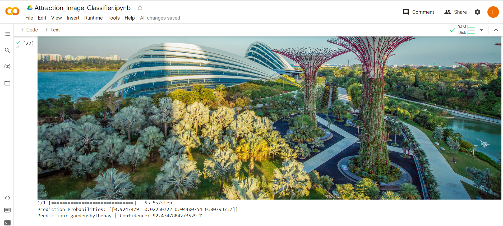

# Singapore Attractions Image Classifier

This project explores the use of Transfer Learning with EfficientNetB7 model, a Convolution Neural Network (CNN), to classify images of 4 iconic tourist attractions in Singapore.
- Gardens by the Bay
- Changi Jewel
- Marina Bay Sands
- Merlion

The Attraction Image Classifier is built upon EfficientNetB7 model as the feature extractor, a Dense layer at the top with 4 output neurons to record the prediction probabilities of each class, and further fine tuning is applied to EfficientNetB7 to specialise the base model towards classification of Attraction images. 

**Model Prediction of Attraction Class with Input Image:**

By inputting an image into the Classfier, the model will return prediction probabilities for each class, the prediction probabilities indicate the likelihood the input image is from the Attraction class.

## Techniques
- Deep Learning Framework (TensorFlow)
- Image Data Augmentation
- Image Classification using Transfer Learning (EfficientNetB7 Model)
- Fine Tuning of Transfer Learning Model
- Early Stopping & Model Checkpoint Callbacks

## Future Roadmap
- Extract a Larger Image Dataset for Model Training

## Acknowledgements
- [TensorFlow Tutorial - Transfer Learning](https://www.tensorflow.org/tutorials/images/transfer_learning)
- [Understanding EfficientNet — The Most Powerful CNN Architecture](https://medium.com/mlearning-ai/understanding-efficientnet-the-most-powerful-cnn-architecture-eaeb40386fad)

## Contributors
- Lim Yu Bin [(@lim-yb)](https://github.com/lim-yb)
